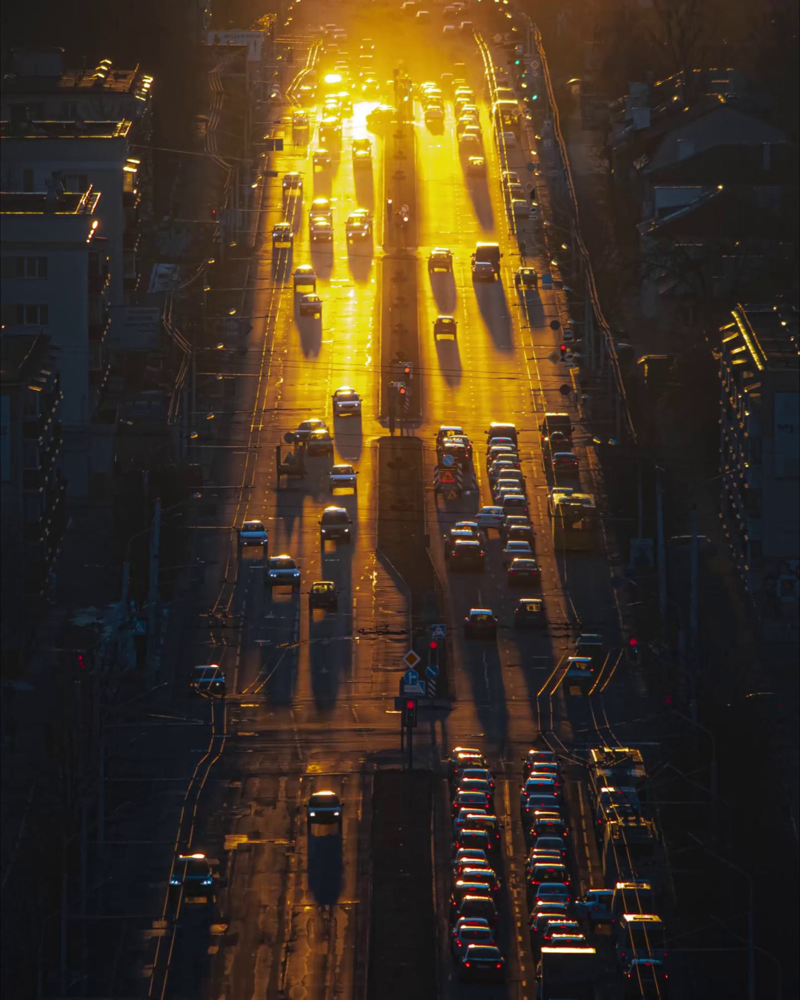
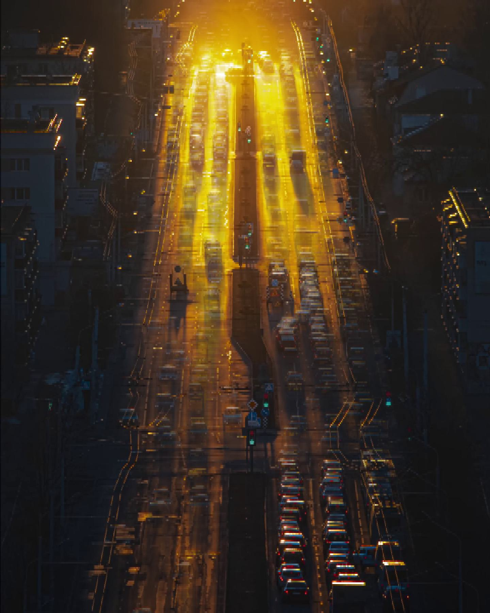
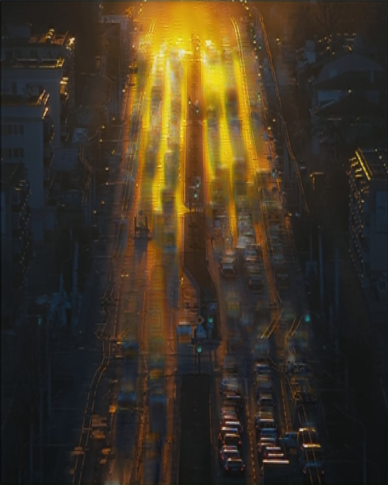
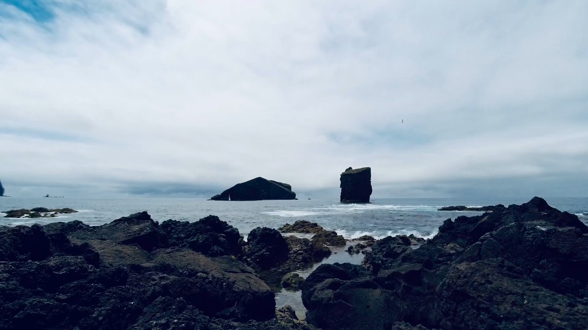
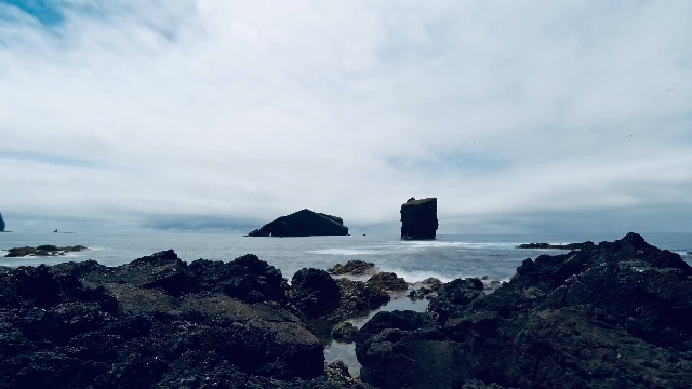
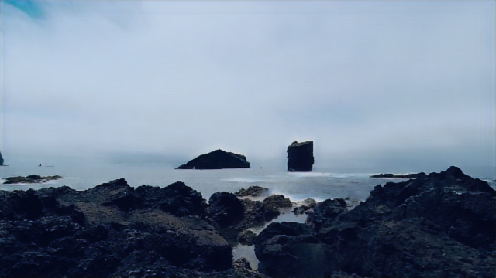
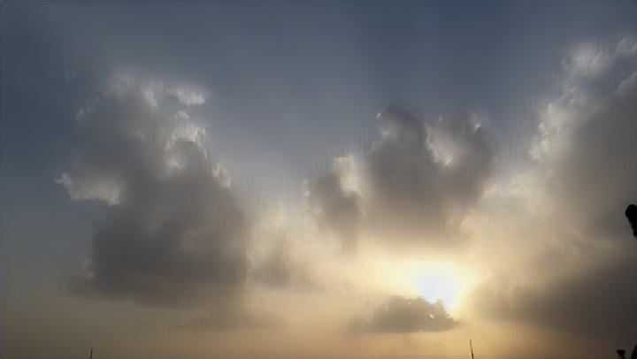

# Computational Long Exposure Images from Optical Flow

We use optical flow encodings to predict long exposure images from a short sequence of standard images. 

We start with the pretrained RAFT model ([Z. Teed and J. Deng, 2020](https://arxiv.org/abs/2003.12039)) to approximate motion fields from a sequence of training images in the form of optical flows.
These flows are encoded into a latent space via a convolutional encoder and concatenated with training images, then inputted together into a convolutional LSTM autoencoder.
The initial encoder and ConvLSTM layers are trained jointly to predict the long exposure image on the Sky Timelapse Dataset by [Xiong et al., 2017](https://arxiv.org/abs/1709.07592).

By combining spatio-temporal information from the flow fields and the image,
we are able to learn motion blur patterns from an input sequence of images and generate convincing long exposure images. 
Despite being trained solely on cloud motion, the model is able to generalize to completely different scenes, such as the cityscape below:

| Sample Image <br/> (1st frame of Input Sequence) | Short Exposure <br/>(Mean of Input Sequence) | ***Generated Long Exposure*** |
|:------------------------------------------------:|:--------------------------------------------:|:-----------------------------:|
|                      |                    |    | 

| Sample Image <br/> (1st frame of Input Sequence) | Short Exposure <br/>(Mean of Input Sequence) | ***Generated Long Exposure*** |
|:------------------------------------------------:|:--------------------------------------------:|:-----------------------------:|
|                     |                      |         | 


The model struggles to predict long exposure images from short sequences of images with large regions of fast motion (large motion blur).
Rather than the dramatic motion blur of a ground truth image, it instead produces small, non-directional blur (shown below). 
This is likely due to the fact that the model is trained on a dataset of cloud motion, which can often be small and result in a uniform blur across the image.

| Sample Image <br/> (1st frame of Input Sequence) | Short Exposure <br/>(Mean of Input Sequence) | ***Generated Long Exposure*** |
|:------------------------------------------------:|:--------------------------------------------:|:-----------------------------:|
|                     |                      |         |


The latest pretrained model can be found in `pretrained_weights/checkpoint_cae_302.pt`.


## Prerequisites
- numpy
- matplotlib
- torch
- torchvision
- opencv-python
- pillow
- tqdm

Baseline Model:
- skimage
- scipy

Dataset Creation:
- shutil
- requests

## Usage
### Training
To train the final model (`models/CAE_ConvLSTM.py`), run the following command:
```
python src/train.py --input_dir <path to input images> --gt_dir <path to ground truth images> --batch_size <batch size> --lr <learning rate> --num_epochs <number of epochs> --img_w <image width> --img_h <image height> --checkpoint <path to checkpoint>
```
### Testing
For testing, please refer to `notebooks/live_demo.ipynb`.

