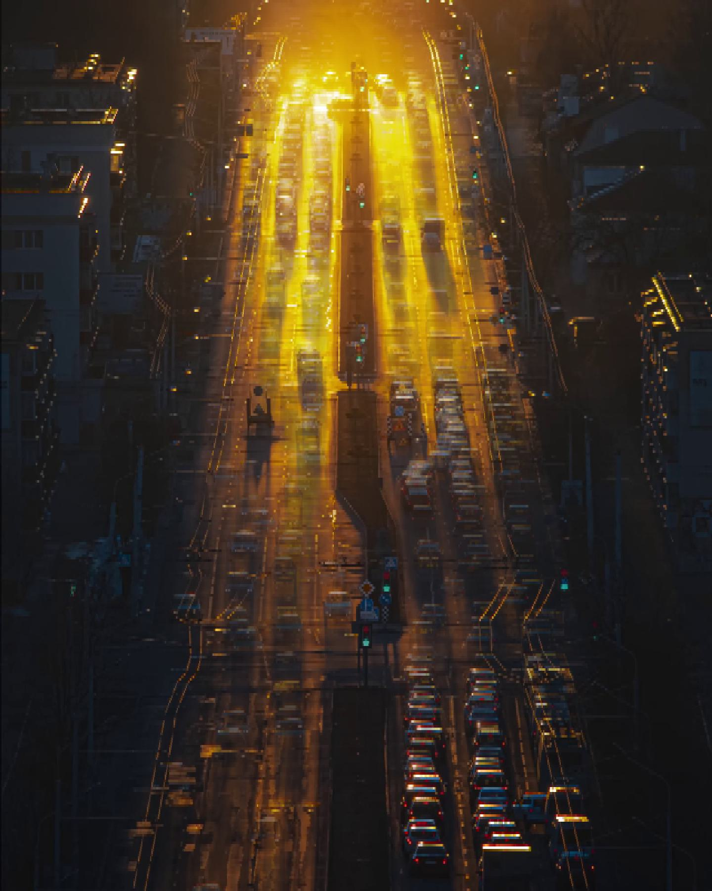
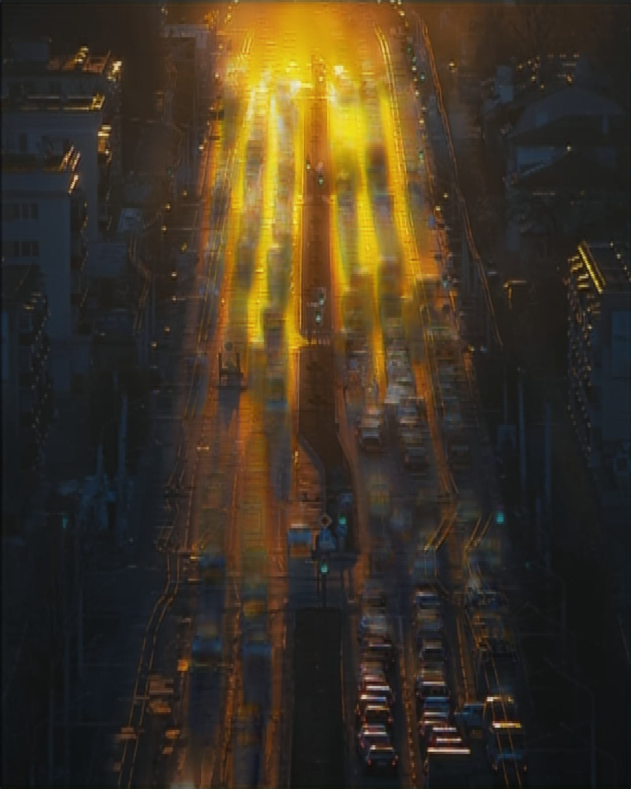

# Predicting Long Exposure Images from Estimated Motion Fields 

We use optical flow encodings to predict long exposure images from short exposure images. 

We use the pretrained RAFT model (Z. Teed and J. Deng, <arXiv:2003.12039>) to approximate motion fields from a sequence of training images using optical flow fields.
We then use a convolutional autoencoder to encode these flows and concatenate them with the training images to form the input to a convolutional LSTM autoencoder.
By concatenating the motion fields with the training images, we are able to learn motion blur patterns from an input sequence of images to generate convincing long exposure images.

| Sample Image <br/> (1st frame of Input Sequence) | Short Exposure <br/>(Mean of Input Sequence) | ***Generated Long Exposure*** |
|:------------------------------------------------:|:--------------------------------------------:|:-----------------------------:|
|                      |                    |    | 


Pretrained models can be downloaded by University of Toronto users (log in required) at: https://uoft.me/96a

## Prerequisites
- numpy
- matplotlib
- torch
- torchvision
- opencv-python
- pillow
- tqdm

Baseline Model:
- skimage
- scipy

Dataset Creation:
- shutil
- requests

## Usage
### Training
To train the final model (`models/CAE_ConvLSTM.py`), run the following command:
```
python src/train.py --input_dir <path to input images> --gt_dir <path to ground truth images> --batch_size <batch size> --lr <learning rate> --num_epochs <number of epochs> --img_w <image width> --img_h <image height> --checkpoint <path to checkpoint>
```
### Testing
For testing, please refer to the `notebooks/live_demo.ipynb` notebook.

